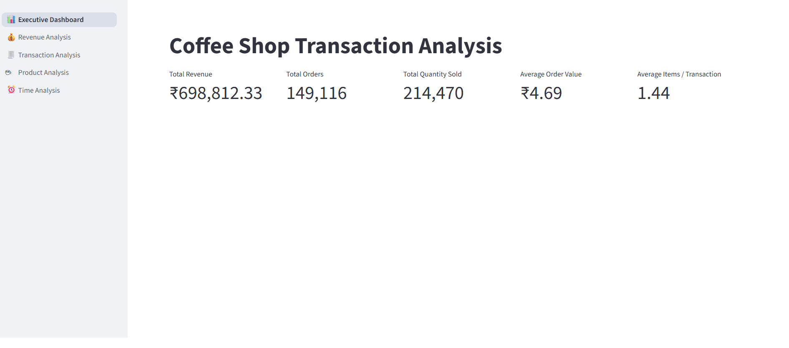

# ☕ Coffee Shop Transaction Analysis

An end-to-end **Coffee Shop Transaction Analysis** project built using **Python and Streamlit** to analyze transaction patterns, revenue performance, product performance, and time-based trends.

The project focuses on converting transaction-level data into **business KPIs, strongly supported visual insights, and actionable recommendations**.

---

## 📊 Dashboard Preview



---

## 🎯 Business Objective

The objective of this project is to analyze coffee shop transaction data and identify meaningful patterns that can support business decision-making.

The analysis focuses on:

* Overall revenue and transaction performance
* Revenue performance across time periods
* Monthly revenue trends
* Monthly transaction trends
* Top revenue-generating products
* Product-level revenue performance
* Operational planning opportunities
* Data-driven business recommendations

---

## 📌 Business KPIs

| KPI                             |       Value |
| ------------------------------- | ----------: |
| **Total Revenue**               | ₹698,812.33 |
| **Total Transactions**          |     149,116 |
| **Total Quantity Sold**         |     214,470 |
| **Average Order Value**         |       ₹4.69 |
| **Average Items / Transaction** |        1.44 |

Detailed KPI calculations are available in **`KPI_Calculations.docx`**.

---

## 📈 Strongly Supported Visualizations

The final analysis includes only visualizations that provide strong evidence for the corresponding business recommendations.

### 1. Revenue by Time Period

**Business Question:**
Which time period generates the highest revenue?

**Observation:**
Morning generates the highest revenue at **₹281,034.57**.

**Business Insight:**
Revenue is strongly concentrated during the Morning period.

**Recommendation:**
Prioritize staffing, inventory availability, and service capacity during Morning hours.

**Support:** Strongly Supported ✅

---

### 2. Revenue by Month

**Business Question:**
How does revenue change across months, and when should the business prepare for higher demand?

**Observation:**
Revenue increases from **₹55,134.34 in February** to **₹119,571.08 in June**, with May and June showing particularly strong performance.

**Business Insight:**
Revenue follows a clear upward trend toward the later months.

**Recommendation:**
Increase inventory planning, staffing, and operational capacity as demand rises, particularly during May and June.

**Support:** Strongly Supported ✅

---

### 3. Top 10 Products by Revenue

**Business Question:**
Which products are the strongest revenue contributors?

**Observation:**
The Top 10 products represent the strongest revenue-generating products in the dataset.

**Business Insight:**
Revenue is concentrated among a group of high-performing products.

**Recommendation:**
Prioritize availability and inventory planning for the highest-revenue products.

**Support:** Strongly Supported ✅

---

### 4. Transactions by Time Period

**Business Question:**
Which time period has the highest transaction volume?

**Observation:**
Morning records the highest transaction volume with **81,751 transactions**.

**Business Insight:**
Customer transaction activity is strongly concentrated during the Morning period.

**Recommendation:**
Prioritize staffing, service capacity, and product availability during Morning hours.

**Support:** Strongly Supported ✅

---

### 5. Transactions by Month

**Business Question:**
How does transaction volume change across months?

**Observation:**
Transactions increase from **16,359 in February** to **35,352 in June**, with May and June showing the highest activity.

**Business Insight:**
Customer transaction activity follows a clear upward monthly trend.

**Recommendation:**
Prepare additional staffing, inventory, and operational capacity for higher-volume months, particularly May and June.

**Support:** Strongly Supported ✅

---

### 6. Revenue by Product

**Business Question:**
Which individual products generate the most revenue?

**Observation:**
**Barista Espresso** generates the highest revenue at **₹91,406.20**, followed by **Brewed Chai tea** at **₹77,081.95** and **Hot chocolate** at **₹72,416.00**.

**Business Insight:**
A group of individual products acts as important contributors to overall revenue.

**Recommendation:**
Prioritize stock availability and inventory planning for high-revenue products, especially Barista Espresso.

**Support:** Strongly Supported ✅

---

## 🔍 Analysis Framework

The project follows a business-focused analytical framework:

**Data → KPI Calculation → Visualization → Observation → Business Insight → Recommendation**

Only strongly supported visualizations are used as evidence for the final business recommendations.

---

## 💡 Key Business Insights

* **Morning** is the strongest period for both revenue and transaction volume.
* Revenue shows a strong upward trend toward **May and June**.
* Transaction volume also increases substantially toward **May and June**.
* High-performing products are important contributors to overall revenue.
* Operational capacity should be planned around periods of higher transaction activity.
* Inventory planning should prioritize high-revenue products.

---

## 🛠️ Tools & Technologies

**Python | Pandas | NumPy | Plotly | Matplotlib | Streamlit | GitHub**

---

## 📂 Project Folder Structure

```text
Coffee-Shop-Transaction-Analysis/
│
├── Dashboard_Screenshots.gif
├── KPI_Calculations.docx
├── Recommendation_Justification.docx
├── app.py
├── coffee_shop_transactions_cleaned.csv
├── requirements.txt
├── .gitignore
└── README.md
```

### 📄 File Description

| File                                   | Description                                                                      |
| -------------------------------------- | -------------------------------------------------------------------------------- |
| `app.py`                               | Main Python application program containing the Streamlit dashboard and analysis. |
| `coffee_shop_transactions_cleaned.csv` | Cleaned transaction-level dataset used for the analysis.                         |
| `Dashboard_Screenshots.gif`            | Animated GIF showcasing the dashboard and key visualizations.                    |
| `KPI_Calculations.docx`                | Calculations and formulas for all business KPIs.                                 |
| `Recommendation_Justification.docx`    | Justification and supporting evidence for each business recommendation.          |
| `requirements.txt`                     | Python libraries required to run the project.                                    |
| `.gitignore`                           | Files and folders excluded from Git tracking.                                    |
| `README.md`                            | Project documentation and analysis overview.                                     |

---

## 🚀 How to Run the Project

### 1. Clone the Repository

```bash
git clone <YOUR_GITHUB_REPOSITORY_URL>
```

### 2. Navigate to the Project Folder

```bash
cd Coffee-Shop-Transaction-Analysis
```

### 3. Install Required Libraries

```bash
pip install -r requirements.txt
```

### 4. Run the Streamlit Application

```bash
streamlit run app.py
```

The dashboard will open in your browser.

---

## 📋 Recommendation Assessment

Each recommendation is evaluated based on the strength of evidence provided by its corresponding visualization.

| Assessment                 | Meaning                                                                                                           |
| -------------------------- | ----------------------------------------------------------------------------------------------------------------- |
| **Strongly Supported ✅**   | The visualization clearly demonstrates the finding and directly supports the recommendation.                      |
| **Partially Supported ⚠️** | The visualization provides some evidence, but the finding is not sufficiently strong for a direct recommendation. |
| **Weakly Supported ❌**     | The visualization does not provide enough evidence to justify the recommendation.                                 |

For the final project analysis, **only Strongly Supported visualizations are retained**.

---

## 📊 Final Analysis Summary

**5 Business KPIs + 6 Strongly Supported Visualizations**

The project combines quantitative KPI calculations with visualization-based business analysis to identify operational and revenue opportunities for a coffee shop.

---

## 👨‍💻 Project Focus

This project demonstrates practical skills in:

* Data cleaning and preprocessing
* KPI calculation
* Exploratory data analysis
* Data visualization
* Business insight generation
* Recommendation development
* Streamlit dashboard development
* Evidence-based decision making
